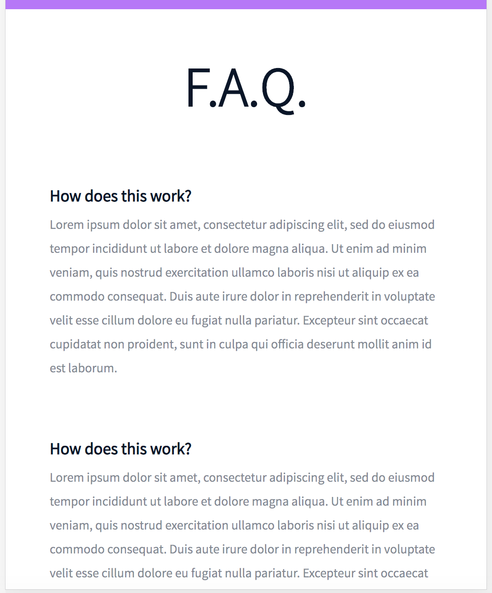

# Smiling School - Implementing a design with bootstrap
In this project, we are implementing 3 web pages built with Bootstrap. We are tying together all the HTML/CSS/Accessibility/Responsive Design/and Bootstrap knowledge we have previously learned We are given freedom to implement the web page as we see fit, however we are to keep our CSS file as small as possible and rely on Bootstrap classes as much as we can. The 3 web pages final results are given to us as Figma designer files, and we are to recreate them. This project will be completed in one week.
## Requirements
- You have to use Bootstrap
- Your styles.css must be as small as you can - you must use as much as you can Bootstrap classes
## Final Results
These are what the final result of our pages should recreate in both the desktop and mobile versions of each page. The pages from left to right are the Homepage, Pricing page, and Courses page.

## Tasks
0. [Read and be familiar with Figma](#Read-and-be-familiar-with-Figma)
1. [Header first](#Header-first)
2. [Carousel of quotes](#Carousel-of-quotes)
3. [Popular videos](#Popular-videos)
4. [Row of smiles](#Row-of-smiles)
5. [Latest videos](#Latest-videos)
6. [... and the footer!](#footer)
7. [Pricing - header](#pricing)
8. [Prices grid](#Prices-grid)
9. [Quotes section](#Quotes-section)
10. [FAQ](#FAQ)
11. [Close the page with a footer](#Close-the-page-with-a-footer)
12. [Courses - header](#courses)
13. [Search filters](#Search-filters)
14. [List of result](#List-of-result)
15. [Close the courses with a footer](#Close-the-courses-with-a-footer)

### Read and be familiar with Figma 
Create an account in Figma and open these files:
- [Homepage](https://www.figma.com/file/hcxMqRWjdj06jHycRkbzOf/Homepage?type=design&node-id=0%3A1&mode=design&t=iJoLzlFhrcbxSuHp-1)
- [Pricing](https://www.figma.com/file/QQmdkH49hKJuJ6244fBXzH/Pricing?type=design&node-id=0%3A1&mode=design&t=6DsY9JhEzAKi9umc-1)
- [Courses](https://www.figma.com/file/zKRy0vMRBjwHaKBn1WnavS/Courses?type=design&node-id=0%3A1&mode=design&t=tDcOvAFZroVFgXfH-1)

And “Duplicate to your Drafts” to have access to all design details.

Important notes with Figma:
- if your computer doesn’t have missing fonts, you can find them here: source-sans-pro and Spin-Cycle-OT
- some values are in float - feel free to round them
- “Be pixel perfect” - yes! but mainly make sure colors, size and position are correct. #C271FF is not purple.

For this task, please write an amazing README.md

Interactions note:
- Web pages must switch to the tablet version when the screen width is 768px
- Web pages must switch to the mobile version when the screen width is 576px
- button hover/active: opacity: 0.9
### Header first
Let’s start by the Homepage: create the header/hero piece

Desktop:

Mobile:

### Carousel of quotes
Create the section “Carousel of quotes”

By using a Carousel component of Bootstrap, create this Carousel of quotes.

You can have for the moment one quote or twice the same for testing (like example below)

### Popular videos
Create the section “Most popular tutorials”

By using a Carousel component of Bootstrap, create this Carousel of video cards.

Reminder:
- Desktop: 4 cards
- Tablet: 2 cards
- Mobile: 1 card

### Row of smiles
Create the section “Free membership”

### Latest videos
Create the section “Latest videos”

Copy the block “Most popular tutorials” to “Latest videos”
###  ... and the footer!
Create the footer

###  Pricing - header
Now, let’s do the pricing page: create the header/hero piece

The mobile version must be the same as the Homepage - it’s time to reuse code!

Desktop:

### Prices grid
Create the prices grid

Desktop:

Mobile:

### Quotes section
Same as the Homepage, create the Carousel of quotes
### FAQ
Create the FAQ grid

Desktop:

Mobile:

### Close the page with a footer
Same as Homepage, create the footer
### Courses - header
Now, let’s do the courses page: create the header/hero piece

The mobile version must be the same as the Homepage - it’s time to reuse code!

Desktop:

### Search filters
Create the search filters section

Dropdown is a nice way to create filters.

For the selected/placeholder value of both dropdown, no need to have dynamic value - static content is totally ok.

Desktop:

Tablet/Mobile:

### List of result
Create the result section of courses

You can reuse the same cell for testing. Don’t forget to test with odd and even number of cells.

### Close the courses with a footer
Same as Homepage and Pricing page, create the footer